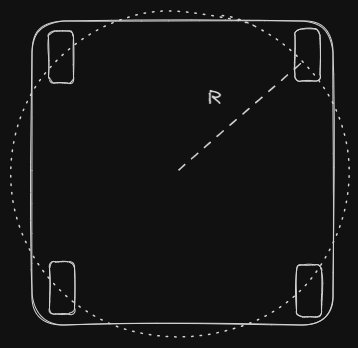

# Swerve Math
### What does the math do?
The math for swerve is concerned with translating "robot actions" to "wheel actions." That is, if you want the robot to move at 3m/s forward while rotation at 0.5rad/s, then the job of the math is to figure out how to move each wheel on the drivetrain to achieve that motion.
### Notes on Units
We will be using degrees, since they're the most intuitive. Angles will be measures as on the unit circle. If you are confused look up what the unit circle is. Also, the x-axis will be forward, so whenever I say the robot will drive forward, I mean that it will drive in the x-positive direction.

## Getting the Velocities for the Wheels
### Translation
Let's say for example that you want the robot to only move forward. That's pretty simple, you just make it point all the wheels forward and spin them forward. Now what if you want to move the robot at a 45 degree angle? That's also fairly easy: just point all the wheel to 45 degrees and spin the wheels forward. So, translation(moving the robot without rotating) is pretty simple for swerve: given a target angle and speed, the angle of each wheel should equal the target angle, and the wheels should spin at the target speed.

Therefore, if given a target velocity vector $v$, the velocities for each wheel will be given by the following equation:
$$
v_i = v
$$
Pretty Simple. 
(Note: If you don't know what a velocity vector is, look at some of the videos [here](https://www.khanacademy.org/science/ap-college-physics-1/xf557a762645cccc5:kinematics-and-introduction-to-dynamics))

### Rotation
What if you want the drivetrain to rotate at a certain speed clockwise/counter-clockwise? To think about this, we will draw an imaginary circle that the wheels lie on in the chassis, as shown below:

To rotate the robot, the wheels just need to point tangent to this circle and spin, as shown:

But how do you control the speed at which the robot spins? Well, to answer this, we need to translate the target rotational velocity to a linear velocity (since the speed of each wheel at the edge of the circle is the linear speed). Spinning the wheels at this speed should rotate the robot at the target rotational velocity. The equation to translate the velocities is as follows:
$$
v_i = \omega R
$$

- $\omega$ is the target rotational velocity
- $R$ is the distance of the wheels from the center of the chassis
- $v_i$ is the velocity of each wheel

However, there is a problem with this: it only takes into account one dimension; $R$ is just one number, so if you have an irregularly shaped chassis, the equation won't work. The bigger problem is that later, when we try to combine rotational and translational motion, we will need the output of the equation to be a vector for each wheel, however, this only returns a scalar(a number that doesn't indicate direction). So instead, we will use this equation
$$
v_i = \omega \times R_i
$$

It's a very subtle change, but $v_i$ will be the cross product of $\omega$ and $R_i$ where both $\omega$ and $R_i$ can be vectors. This keeps the output, $v_i$, as a vector. Also note that instead of $R$, we will be using $R_i$, which will represent the coordinates of each wheel relative to the robot's center. So if one of the wheels is 0.75m to the right and 0.5m up from the center of the robot, $R_i$ will be $\begin{bmatrix} 0.75 \\ 0.5 \end{bmatrix}$.
### Combining Rotation and Translation

In a competition, you won't just be doing rotation or translation, you'll be doing a combination of both. So we will need an equation that gives the velocity for each wheel given a target velocity for translation and a target rotational velocity. It turns out this is pretty simple: we just combine the two equations from the previous sections:
$$
v_i = v + \omega \times R_i
$$

This formula is the core of the drivetrain. Just to review, here is what all the symbols mean:

- $v_i$ is the velocity of the $i$th wheel.
- $v$ is the target translational velocity for the robot.
- $\omega$ is the rotational velocity for the robot.
- $R_i$ is the distance from the center of the robot to the $i$th wheel.

All of this might be confusing if you have never been exposed to kinematics, so take a moment to make sure you understand everything and ask questions in the discord if you have them.

Note that $v_i$ is going to be a 2D vector that indicates the velocity of the $i$th wheel, but it is going to be helpful to split the equation for $v_i$ so that we have two equations that output scalars(we need to isolate x and y components.

So the equations for the x and y components will be as follows(look at [this page](https://www.mathsisfun.com/algebra/vectors-cross-product.html) for how these could be derived):
$$
\displaylines{
v_{ix} = v_x - \omega R_{iy} \newline
v_{iy} = v_y + \omega R_{ix}
}
$$

$\omega$ is the target rotational speed. Here is a diagram that illustrates what all the other symbols are:

## Field Oriented Control

### Why use Field Oriented Control?

When controlling a swerve drivetrain, it is very helpful to dissociate the turning with the translation motion. However, this means that the driver would need to constantly adjust for how the robot is turned. So, if the robot is turned 180 degrees, the driver would need to go "back" to drive forward. This is very hard to do during a competition, so it is better to have the robot use field-oriented control, where a command to drive "forward" will always move the robot away from the driver.

### Math for Field-Oriented Control

We need two things to achieve field oriented control: an input($\vec{v}$; the driver gives through the controller), and the robot rotation relative to the field($\theta$ ; we get this from the gyro). The input vector can be represented as so:
$$
\vec{v} = \begin{bmatrix}
v_x \newline
v_y
\end{bmatrix}
$$
where:

- $\vec{v}$ is the target velocity vector of the robot
- $v_x$ is the field oriented $x$-velocity of the robot
- $v_y$ is the field oriented y-velocity of the robot

In order for the robot to always move relative to the field rather than itself, we need to rotate the field commands by the inverse of the robot rotation. For instance, if the driver wants the robot to move forward, the input vector for that might look like $\begin{bmatrix} 1 \\ 0 \end{bmatrix}$(remember the x-axis is forward). So, for the robot to always move relative to the field, the vector needs to be rotated opposite to the robot's rotation on the field. So, if the robot is rotated 45 degrees relative to the field(towards the left wall), the input vector needs to be rotated -45 degrees, so the forward input vector from before would now be $\begin{bmatrix} .71 \\ .71 \end{bmatrix}$ (notice that the magnitude of the vector -- the speed -- doesn't change):

Therefore, for every field relative input that we get from the controller, we need to rotate it by the inverse of the robot rotation before feeding it through the kinematics to get the wheel velocities. This can be done with a rotation matrix. We have to multiply the field relative velocity vector $v$ with the rotation matrix to get the robot-relative velocity:

$$
\displaylines{
A=\begin{bmatrix}
cos(\theta) && -sin(\theta) \newline
sin(\theta) && cos(\theta)
\end{bmatrix} \hspace{1em}
v_{r} = Av
}
$$
where:

- $A$ is the rotation matrix
- $\theta$ is the robot angle relative to the field
- $v_r$ is the field relative target velocity

This math can be converted to scalar for so that it is easier to code:
$$
\displaylines{
v_{rx} = v_xcos(\theta) - v_xsin(\theta) \newline
v_{ry} = v_ysin(\theta) + v_ycos(\theta)
}
$$
where:

- $v_{rx}$ is the $x$-component of the robot relative target velocity
- $v_{ry}$ is the $y$-component of the robot relative target velocity
- $v_x$ is the $x$-component of the field relative target velocity
- $v_y$ is the $y$-component of the field relative target velocity
- $\theta$ is the robot angle relative to the field

## Summary

The inputs are first collected from the driver. These are essentially 3 numbers: the $x$ and $y$ components of the field-relative target velocity and the target rotational velocity $\omega$. The $x$ and $y$ components can be represent as a vector $\vec{v}$:
$$
\displaylines{
\vec{v} = \begin{bmatrix} 
v_x \newline 
v_y
\end{bmatrix}
}
$$
This $\vec{v}$ is then translated to the robot-relative target velocity as described in [this section](#math-for-field-oriented-control). The robot relative velocity and the $\omega$ from the driver inputs can be fed through the kinematics described [here](#getting-the-velocities-for-the-wheels) to get the wheel velocities. Then PID controllers can be used to enforce these target velocities on each module.
